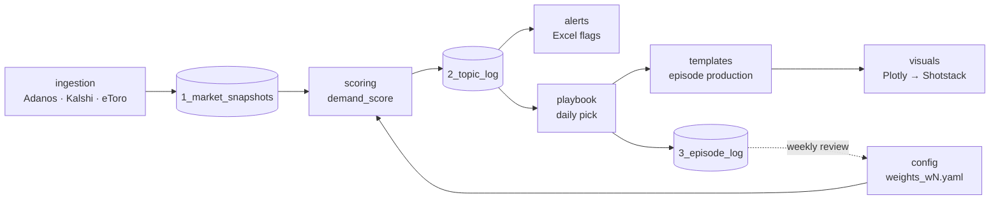

# Metrixx Topic Log

The Topic Log is the data system behind MYCAST topic selection. It collects market and sentiment data from Adanos, Kalshi and eToro, scores every candidate ticker once a day, picks the ticker for that day's episode, and feeds episode results back into the scoring.

This README describes how the repository is organised and what each module is responsible for. For the selection procedure itself, see the [playbook](playbook/README.md).

---

## How the pieces fit



Data moves left to right once a day. The dotted line is the review loop: results in the episode log change the config, never the code.

---

## Modules

| Folder | Task | Responsibility | Status |
|---|---|---|---|
| [`playbook/`](playbook/) | 1 | The selection procedure: gates, scoring logic, tiers, angles, overrides, review loop. Website + write-up. | v0 draft |
| [`config/`](config/) | 1, 6 | Every tunable number (thresholds, weights, tier rules), versioned, plus the changelog. | w0 draft |
| [`schema/`](schema/) | — | Definition of the three Topic Log sheets and their columns. | v0 draft |
| [`ingestion/`](ingestion/) | 4 | Collectors running continuously on the VPS; write raw snapshots. | planned |
| [`scoring/`](scoring/) | 6 | Computes `demand_score`, tier and rank from snapshots + config; writes Sheet 2. | planned |
| [`alerts/`](alerts/) | 3 | Conditional flags and colour rules in the Excel view of the Topic Log. | planned |
| [`templates/`](templates/) | 2 | Production template for each episode, deployed to production. | scope TBD |
| [`visuals/`](visuals/) | 5 | Plotly charts of Topic Log data rendered for Shotstack video. | planned |

Each folder has its own `README.md` with the module's inputs, outputs, dependencies and usage. Keep that file current when the module changes.

### Build order

```
ingestion (4) ──► scoring (6) ──► alerts (3)
                        │
                        └──────► visuals (5)
playbook (1) and config: already in place, updated as the others land
templates (2): scope to be confirmed
```

Scoring needs day-over-day deltas, which need ingestion running continuously. Alerts and visuals read scoring output.

---

## Conventions

**Language.** Code, comments, docs and field names are in English.

**Field names.** `lowercase_with_underscores`, matching the column names in `schema/`. A field has the same name in the sheets, the code and the config.

**Time.** All timestamps are UTC, ISO 8601 (`2026-09-16T23:45:30Z`). Local times appear only in human-facing docs and are labelled (e.g. "07:00 ET").

**Parameters live in `config/`.** No threshold, weight or tier rule is hard-coded in `scoring/`, `alerts/` or `visuals/`. Code reads the active `config/weights_wN.yaml`.

**Config is versioned, never edited in place.** A change means a new file (`weights_w1.yaml`), a new `version`, and an entry in `config/CHANGELOG.md`. Every Sheet 2 row records the `weights_version` it was scored with. Details in the [playbook, section 10](playbook/README.md#10-using-the-config-and-changelog).

**No secrets or raw data in git.** API keys go in a local `.env` (ignored). Raw snapshots live on the VPS / database, not in the repo. Small illustrative samples are fine under a `samples/` subfolder, clearly named.

**Branches.** Work on a branch (`feat/ingestion-kalshi`, `fix/scoring-renorm`, `docs/...`) and merge to `main` through a pull request. `main` is always the version in use.

---

## Quick start

| I want to… | Go to |
|---|---|
| Understand how a ticker gets picked | [`playbook/README.md`](playbook/README.md) |
| See the procedure and try the weights interactively | open [`playbook/index.html`](playbook/index.html) in a browser |
| Check or change a threshold or weight | [`config/weights_w0.yaml`](config/weights_w0.yaml), then [`config/CHANGELOG.md`](config/CHANGELOG.md) |
| Look up what a column means | [`schema/README.md`](schema/README.md) |
| Work on a module | that module's `README.md` |

---

## Repository layout

```
Metrixx-TopicLOG/
├── README.md              ← this file: project map and conventions
├── playbook/              Task 1 · selection procedure
│   ├── index.html         website version
│   └── README.md          full write-up
├── config/                shared · scoring parameters
│   ├── weights_w0.yaml
│   └── CHANGELOG.md
├── schema/                Topic Log sheet definitions
├── ingestion/             Task 4 · VPS collectors
├── scoring/               Task 6 · demand_score
├── alerts/                Task 3 · Excel alerts
├── templates/             Task 2 · production template
└── visuals/               Task 5 · Plotly → Shotstack
```
