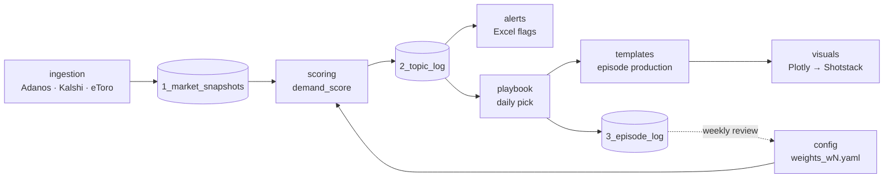

# Metrixx Topic Log

The Topic Log is the data system behind MYCAST topic selection. It collects market and sentiment data from Adanos, Kalshi and eToro, scores every candidate ticker once a day, picks the ticker for that day's episode, and feeds episode results back into the scoring.

This README describes how the repository is organised and what each module is responsible for. For the selection procedure itself, see the [playbook](playbook/README.md).

---

## How the pieces fit



Data moves left to right once a day. The dotted line is the review loop: results in the episode log change the config, never the code.

---

## Modules

| Folder | Responsibility | Status |
|---|---|---|
| [`playbook/`](playbook/) | The selection procedure: gates, scoring logic, tiers, angles, overrides, review loop. Website + write-up. | v0 draft |
| [`config/`](config/) | Every tunable number (thresholds, weights, tier rules), versioned, plus the changelog. | w0 draft |
| [`schema/`](schema/) | Definition of the three Topic Log sheets and their columns. | v0 draft |
| [`ingestion/`](ingestion/) | Collectors running continuously on the VPS; write raw snapshots. | v0: backfill + live snapshot |
| [`scoring/`](scoring/) | Computes `demand_score`, tier and rank from snapshots + config; writes Sheet 2. | v0: scoring + features |
| [`alerts/`](alerts/) | Conditional flags and colour rules in the Excel view of the Topic Log. | planned |
| [`templates/`](templates/) | Production template for each episode, deployed to production. | scope TBD |
| [`visuals/`](visuals/) | Plotly charts of Topic Log data rendered for Shotstack video. | planned |
| [`backtest/`](backtest/) | Replays the daily selection on history and tests whether picks were newsworthy. Self-contained; reads ingestion, scoring, config. | v0: crypto + indices study |

Each folder has its own `README.md` with the module's inputs, outputs, dependencies and usage. Keep that file current when the module changes.

### Build order

```
ingestion ──► scoring ──► alerts
                 │
                 └──────► visuals
playbook, config, schema: in place, updated as the others land
templates: scope to be confirmed
```

Scoring needs day-over-day deltas, which need ingestion running continuously. Alerts and visuals read scoring output.

---

## Design decisions

The modules fall into three layers:

| Layer | Folders | Role |
|---|---|---|
| **Rules** | `playbook/`, `config/`, `schema/` | Define how a ticker is picked, with which numbers, using which field names |
| **Execution** | `ingestion/`, `scoring/` | Collect data and compute scores |
| **Output** | `alerts/`, `templates/`, `visuals/` | Turn scores into things people look at |

**Parameters are separated from code (`config/`).** Scoring, alerts and visuals all use thresholds and weights. If each hard-coded its own copy, one change would have to be made in several places and the copies would drift. With one YAML file, a parameter change needs no code change, every change is versioned, and every Topic Log row can be traced to the exact parameters that produced it. The changelog sits next to the file it tracks.

**Field names are a contract (`schema/`).** If ingestion writes `mkt_volume_24h`, scoring must read `mkt_volume_24h`. Column definitions live in one place and every module follows them. A column change starts in `schema/`.

**The rules are written twice, for two readers.** `playbook/` explains the rules and the reasons for them to people. `scoring/` implements the same rules in code. The two are tied together by a test: scoring must reproduce the worked example in the playbook (NDX 0.584, NVDA 0.416, TSLA 0.349, AAPL 0.167, DJI 0.059). If the test fails, either the code or the playbook is wrong.

**Every module README has the same shape.** Purpose, Inputs, Outputs, Depends on, Contents, Usage. Anyone opening a folder can see what it consumes, what it produces and what it needs, before reading any code. Modules not yet built already have their interfaces written down.

**This README is a map, not a manual.** It covers how modules relate and the conventions they share. How a ticker gets picked is in `playbook/README.md`; how a module works is in that module's README.

**Raw data stays out of git.** Snapshots grow by about 40,000 rows a day and belong on the VPS or in a database. Git holds code, config and docs.

---

## Conventions

**Language.** Code, comments, docs and field names are in English.

**Field names.** `lowercase_with_underscores`, matching the column names in `schema/`. A field has the same name in the sheets, the code and the config.

**Time.** All timestamps are UTC, ISO 8601 (`2026-09-16T23:45:30Z`). Local times appear only in human-facing docs and are labelled (e.g. "07:00 ET").

**Parameters live in `config/`.** No threshold, weight or tier rule is hard-coded in `scoring/`, `alerts/` or `visuals/`. Code reads the active `config/weights_wN.yaml`.

**Config is versioned, never edited in place.** A change means a new file (`weights_w1.yaml`), a new `version`, and an entry in `config/CHANGELOG.md`. Every Sheet 2 row records the `weights_version` it was scored with. Details in the [playbook, section 10](playbook/README.md#10-using-the-config-and-changelog).

**No secrets or raw data in git.** API keys go in a local `.env` (ignored). Raw snapshots live on the VPS / database, not in the repo. Small illustrative samples are fine under a `samples/` subfolder, clearly named.

**Branches.** Work on a branch (`feat/ingestion-kalshi`, `fix/scoring-renorm`, `docs/...`) and merge to `main` through a pull request. `main` is always the version in use.

---

## Quick start

| I want to… | Go to |
|---|---|
| Understand how a ticker gets picked | [`playbook/README.md`](playbook/README.md) |
| See the procedure and try the weights interactively | open [`playbook/index.html`](playbook/index.html) in a browser |
| Check or change a threshold or weight | [`config/weights_w0.yaml`](config/weights_w0.yaml), then [`config/CHANGELOG.md`](config/CHANGELOG.md) |
| Look up what a column means | [`schema/README.md`](schema/README.md) |
| Work on a module | that module's `README.md` |
| See backtest results | [`backtest/runs/INDEX.md`](backtest/runs/INDEX.md) |

---

## Repository layout

```
Metrixx-TopicLOG/
├── README.md              ← this file: project map and conventions
├── playbook/              selection procedure
│   ├── index.html         website version
│   └── README.md          full write-up
├── config/                shared · scoring parameters
│   ├── weights_w0.yaml
│   └── CHANGELOG.md
├── schema/                Topic Log sheet definitions
├── ingestion/             VPS collectors
├── scoring/               demand_score
├── alerts/                Excel alerts
├── templates/             production template
├── visuals/               Plotly → Shotstack
└── backtest/              selection replay on history
```
