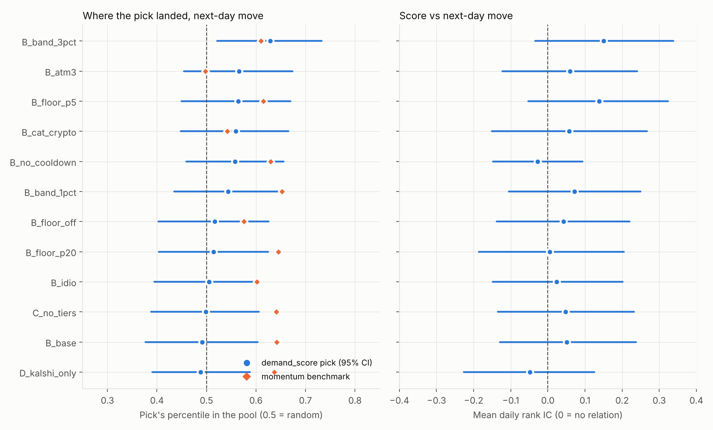
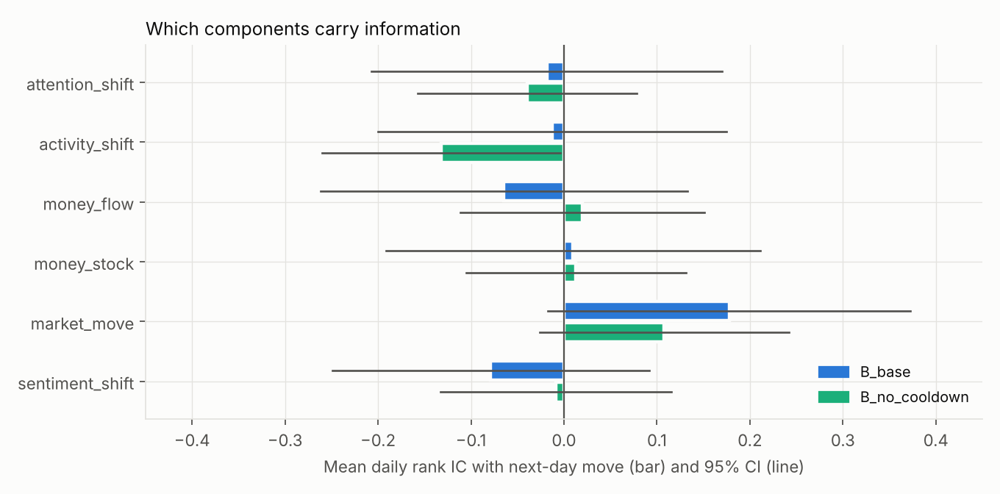
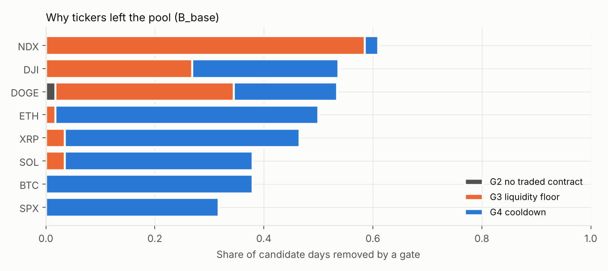

# Backtest report — crypto + indices (study `crypto_indices`)

Run date 2026-10-02 · code `df59eee` · weights `w0` · window 2026-08-04 → 2026-09-30 (58 pick days)

## Summary

1. **No evidence that `demand_score` picks the tickers that move most after the pick.** The main version (B) puts its pick at the 49th percentile of the pool (random = 50th; 95% CI 38–60), with a mean daily rank IC of +0.05 (permutation p = 0.28). None of the 11 versions is significant after correcting for the number tested (best: `B_band_3pct`, p = 0.010 → 0.12 after Holm).
2. **A naive benchmark does better.** Picking the pool's biggest mover into the pick ("momentum") lands at the 64th percentile (p ≈ 0.005 vs random) in B's pools and the 63rd (p ≈ 0.002) in the full, cooldown-free pool. Large moves cluster; `demand_score` does not capture that.
3. **Only `market_move` points the right way** (IC +0.11 to +0.18, t ≈ 1.6–1.8, not significant). The three Adanos components and the two Kalshi money components are indistinguishable from zero.
4. **The test can only see large effects.** With ~54 days and ~3.7 tickers per pool, a true IC below ~0.17 would not be detected. A null result here means "no large effect", not "no effect".
5. **The harness itself is sound.** Oracle = perfect; random scores over 200 seeds average IC −0.001 and pick percentile 0.499; look-ahead and past-only tests pass.

## What was tested

**Question.** On pick day *t* at 15:00 ET, built from data available then, does the board rank highest the tickers whose next move is largest relative to their own volatility?

**Universe.** BTC, ETH, SOL, XRP, DOGE (every day) and SPX, NDX, DJI (trading days). Weekend pools are crypto only.

**Data.**

| Source | Used | Timing rule |
|---|---|---|
| Kalshi daily above/below ladders (17:00 ET crypto, 16:00 ET indices) | whole-ladder volume and open interest, ATM probability path, spread and zero-trade share near ATM | state at four snapshots (21:00, 03:00, 09:00, 15:00 ET) from candles closed by then |
| Kalshi 15:00 ET hourly events | settlement value = reference price for labels | label window starts at the pick |
| Adanos Reddit (crypto tokens; SPY / QQQ / DIA for indices) | `buzz_score`, `mentions`, `sentiment_score` | complete UTC days only: *t*−1 vs *t*−2 |
| Yahoo daily closes | trailing 20-day sigma, BTC beta | dates strictly before *t* |

**Label.** |log return| from 15:00 ET *t* to 15:00 ET next session, divided by trailing 20-day sigma.

**Procedure.** Exactly the playbook (chapters 3–5) via `scoring/`: gates → percentiles → renormalised weights → quality × cooldown → tier → pick. Cooldown uses the replay's own picks. CPI and FOMC dates are T1 catalysts for indices.

## Results



Full table with confidence intervals and links to each run: [`../INDEX.md`](../INDEX.md).

| Version | Change vs B | Pick pctl | IC | p (Holm) | Momentum pctl |
|---|---|---|---|---|---|
| **B_base** | — | 0.492 | +0.051 | 1.00 | 0.642 |
| C_no_tiers | no tiers | 0.498 | +0.048 | 1.00 | 0.641 |
| D_kalshi_only | Kalshi components only | 0.488 | −0.049 | 1.00 | 0.637 |
| B_no_cooldown | no G4 / soft cooldown | 0.558 | −0.028 | 1.00 | 0.630 |
| B_atm3 | liquidity on 3 nearest strikes | 0.566 | +0.059 | 1.00 | 0.498 |
| B_band_1pct / 3pct | ATM band ±1% / ±3% | 0.543 / 0.629 | +0.072 / +0.150 | 1.00 / 0.12 | 0.653 / 0.610 |
| B_floor_off / p5 / p20 | volume floor off / 5th / 20th pct | 0.516 / 0.564 / 0.514 | +0.042 / +0.138 / +0.005 | 1.00 | 0.576 / 0.615 / 0.645 |
| B_cat_crypto | CPI/FOMC also catalysts for crypto | 0.560 | +0.058 | 1.00 | 0.542 |
| B_idio | crypto label net of BTC beta | 0.505 | +0.024 | 1.00 | 0.602 |

Reading the variations: changing one threshold moves the pick percentile by up to +0.14 with no consistent pattern. The volume floor at the 10th percentile (B) scores below the 5th, the 20th and no floor at all, a non-monotone result typical of noise. None of these should be read as a tuning signal.

### Components



`market_move` is the only component positive in both pools. `activity_shift` (Reddit mentions) is negative in the full pool (t = −2.0), but with six components tested one |t| ≈ 2 is expected by chance. With and without the Adanos components (B vs D) the results are indistinguishable.

### Gates



- **G4 cooldown is the largest filter.** With eight tickers and a 3-day window, it removes 32–48% of candidate days for the names picked most often (BTC, ETH, SOL, XRP, SPX), leaving pools of 2–6 (mean 3.7). The pick is often a choice between two or three names.
- **G3 removes NDX on 59% of days and DOGE on 33%.** This is a measurement artifact, not illiquidity: a fixed ±2% band holds ~120 strikes for NDX (most never trade) but ~1 for DOGE. `B_atm3` measures on the 3 nearest strikes instead (a structural choice made before seeing any result).

## Checks against biased validation

| Check | Result |
|---|---|
| Snapshot uses only candles closed by the snapshot time | pass |
| Every feature timestamp ≤ pick time | pass (asserted on every row) |
| Adanos values dated on the pick day cannot change that day's features | pass |
| Volume floor, sigma and beta unchanged when future data is altered | pass |
| Oracle (score = label) | IC = 1.00, top-1 hit = 1.00 |
| Random scores, 200 seeds | IC −0.001 (sd 0.062), pick pctl 0.499 (sd 0.046) |
| Labels shuffled within day | IC +0.02, pick pctl 0.515 |
| Thresholds fixed before results | yes; `B_atm3` added from a structural check only |
| Multiple versions | all reported; Holm-adjusted |
| A pick without a label | day skipped, never replaced by the next name |
| Playbook worked example | reproduced exactly (`scoring/tests`) |

## Data notes

- Kalshi serves event-level candles only after its historical cutoff (2026-08-02), which bounds the window.
- `KXDJI-26SEP1015` has a malformed settlement value at source (`"No"`); treated as missing. Labor Day (09-07) has no index ladders.
- DIA has Reddit data on 44% of days, so DJI often has one source; renormalised, never zero-filled.
- DOGE quotes are sparse; `market_move` is missing on ~14% of DOGE days.
- The Adanos key in use allows 250,000 requests/month and 70+ days of history (not the free tier).

## Limitations

- **Short sample, one regime.** 54 evaluated days; minimum detectable IC ≈ 0.17 (full pool ≈ 0.12). Detecting IC ≈ 0.08 would need roughly 250 days.
- **The label is a proxy.** It measures how much the price moved, not whether the audience cared. The playbook's real target (`avg_view_duration_pct` in `3_episode_log`) is the decisive test once episodes accumulate.
- **Crypto is correlated.** Five of eight tickers share a common factor; `B_idio` addresses this for crypto labels and changes little.
- **Conservative timing.** At 15:00 ET the live system could use part of day *t*'s Adanos data; the backtest does not.

## Recommendations

1. **Start the VPS collector now** (`ingestion.pull snapshot`, four times a day). Sample size is the binding constraint, and Kalshi history beyond its cutoff only exists if we store it ourselves.
2. **Do not change component weights on this evidence.** Nothing here is significant; reweighting would fit noise.
3. **Proposed w1 (one change, per the review-loop rule):** measure the G3 liquidity floor on the 3 strikes nearest the implied median for Kalshi ladders. Justification is structural (comparability across strike spacing), not performance. Draft in [`backtest/proposals/`](../../proposals/).
4. **Pre-register momentum as a candidate.** Add the prior period's abnormal move as a seventh component in a new version and test it on October–November data only, so it is judged out of sample.
5. **Treat momentum as the bar to beat.** Any future version should report pick − momentum; a score that loses to "who moved most yesterday" is not adding information.
6. **Revisit cooldown for the signal test.** For editorial use the 3-day cooldown stays; for validating the score, `B_no_cooldown` is the cleaner read.

## Reproduce

```bash
python -m backtest.run --study backtest/studies/crypto_indices
python -m backtest.report_charts --study crypto_indices
python -m pytest -q backtest/tests scoring/tests
```
